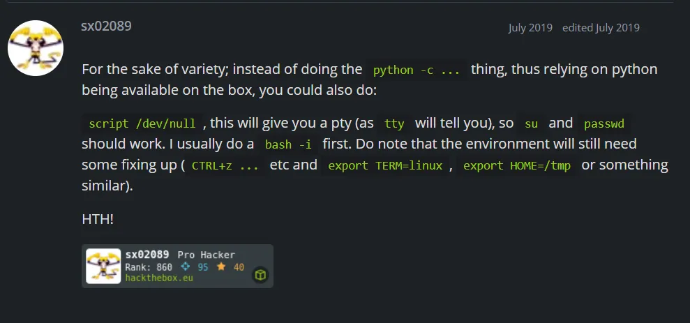

# How to Get a Fully Interactive Reverse Shell


It is a pain when you make a typo in your reverse shell and then accidentally close the shell with CTRL+C. It’s also a pain because:

* It has no arrow-up
* It has no tab-completion
* It is just uncomfortable!

In this post, I’ll share a quick tip to make your reverse shell a bit comfortable to use, it’s almost like SSHing the machine!

## Step 1: Spawn a TTY shell!

First, we need to upgrade our current non-TTY shell into a TTY shell using the common Python PTY module.

```shell 
$ python -c "import pty; pty.spawn('/bin/bash')"
```

Or

```shell
$ python3 -c "import pty; pty.spawn('/bin/bash')"
```

If there’s no python installed in the machine you can try this



```shell
$ script /dev/null -c bash
```

## Step 2: Upgrade to Full Interactive Shell

We press `CTRL^Z` to suspend the shell momentaneously and execute the command below.

```shell
stty raw -echo; fg
```

We won't see any output, but we can type `reset` and specify `xterm` as the terminal type.

```shell
[1]  + continued  nc -nlvp 5555
                              reset
reset: unknown terminal type unknown
Terminal type? xterm
```

Command above will return us to the remote machine's shell.
Now we need to make sure that the following variables are set as following:

```shell
export TERM=xterm
export SHELL=bash
```

Now we have a fully interactive shell, but in order to make it fit our screen we will need to specify columns and rows values for the tty. In order to know what values are the correct ones, we can run the following command from our machine.

```shell
stty size
```

Once we know what the values are, we set them running the following command.
> Where x equals your rows and y equals your columns.

```shell
stty rows x columns y
```

Now you should be able to use arrows key and tab completion in the shell.

Since normal Ctrl + C won’t close this shell, you have to kill its process or just type ```$ exit```.

If your shell prompt is messed up after exiting, type ```$ stty sane```.

Note: It won’t work with ```rlwrap```.

